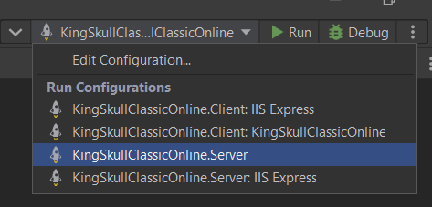
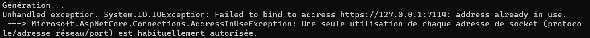

# KingSkullClassicOnline

### Auteurs

[Stéphane](https://github.com/BernardLhermite),
[Géraud](https://github.com/GeraudSilvestri),
[Loris](https://github.com/Loris199),
[Alexandre](https://github.com/AJaquier),
[Loïc](https://github.com/loicrheig)

## Introduction

Ce projet a été réalisé pour le cours PDG de l'HES d'été 2022.
Le but était de réaliser un projet de A à Z, en utilisant un pipeline CI/CD et de présenter notre résultat final.
Le sujet du projet était libre dans son contenu, nous avons donc décidé de réaliser une adaptation en ligne d'un jeu de cartes dont nous sommes habitués, le [Skull King](https://www.schmidtspiele.de/files/Produkte/7/75024%20-%20Skull%20King/75024_Skull_King_DE_FR_IT_GB.pdf#page=3).

## Installation du projet

Ce projet est composé de 4 sous-programmes :

- Client qui gère les interactions avec l'utilisateur et contient le design des pages
- Server qui sert de WebAPI. Cette partie va résoudre la communication entre les différents utilisateurs d'une room.
- Engine qui est une librairie contenant toute la logique du jeu SkullKing.
- Engine.Tests contenant les tests unitaires.

### Prérequis

[.NET 6](https://dotnet.microsoft.com/en-us/download/dotnet/6.0). Il faut installer le SDK. Un redémarrage est nécessaire après l'installation.

Selon la machine, il est nécessaire d'ajouter dotnet dans la variable système Path.

Pour cela, vous devez aller dans "Modifier les variables d'environnement système" -> "variables d'environnement" -> Dans variable système, sélectionner Path -> modifier ->  Nouveau. Il faut ajouter le chemin où se situt l'éxecutable dotnet, par défaut il se situe sur **C:\Program Files\dotnet**.

Pas obligatoire : IDE ([Rider](https://www.jetbrains.com/fr-fr/rider/))

### Marche à suivre

#### Depuis RIDER : 

Après avoir cloné ce projet, celui-ci peut être exécuté en sélectionnant la configuration de run Server puis en pressant sur le bouton run.

#### En ligne de commande :

Depuis la racine du projet, lancez la commande :

`` dotnet run --project ./src/Server ``

Normalement, les packages NuGet devraient s'installer automatiquement, cependant si ce n'est pas le cas, voici une liste des packages explicitement installés.

- Microsoft.AspNetCore.SignalR.Client
- MudBlazor
- NUnit
- NUnit3TestAdapter
- LibSassBuilder

Si lors de l'exécution, cette erreur apparaît :

Cela indique que le port utilisé par ASP pour faire tourner l'application en local est déjà utilisé par un autre processus sur votre machine. Il est nécessaire de libérer ce port.

Ainsi, l'application devrait normalement être accessible sur [https://localhost:7114/](https://localhost:7114/). Notez que le port peut varier.
